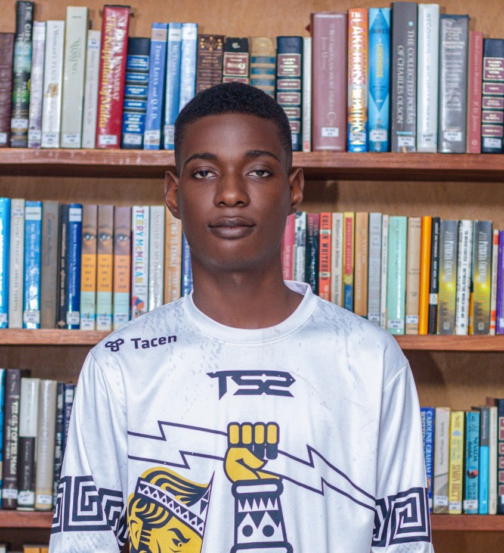

# Hi, I'm Tini Degan 👋

  

<h2 align="center">Tini Degan</h2>

Hydrology x AI | Building intelligent systems for water monitoring 🌍

🎯 Hydrology student specialized in ecohydrology  
🤖 Passionate about Artificial Intelligence & Data Science  
🌍 Building solutions for water quality monitoring  

## 🚀 Current Work
- Chlorophyll-a & Turbidity estimation (Sentinel-2 + ML)
- Water quality prediction models (Random Forest, SVR)
- Environmental data analysis & modeling

## 🧠 Skills
- Python (Pandas, NumPy, Scikit-learn)
- Machine Learning (RF, SVR)
- Google Earth Engine, QGIS
- R (statistical analysis)

## 🌍 Vision
Develop intelligent real-time monitoring systems for water resources in Africa.

## 📫 Contact
- Email: degantinikadoukpe@gmail.com
- LinkedIn: linkedin.com/in/tini-degan-3936ab29b
